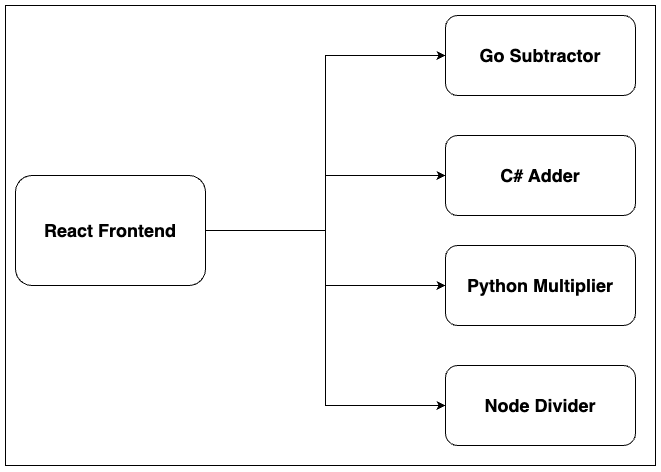

## distributed-calculator
This is a demo project to demonstrate microservices architecture. The project is a simple calculator in which operation is managed by a separate service. The services are written in different languages:
- **calculator** - This is a React application which is the front-end of the project
- **go-subtractor** - This is a Go service which subtracts two numbers.
- **csharp-adder** - This is a C# service which adds two numbers.
- **python-multiplier** - This is a Python service which multiplies two numbers.
- **nestjs-divider** - This is a Nest.js service which divides two numbers.

Here's a high-level architecture of the project:


## How to run the project
1. Clone the repository
```bash
$ git clone https://github.com/Thwani47/distributed-calculator.git
```
2. Run the services
```bash
$ cd src
$ docker-compose up
```
3. Open the calculator in your browser
```
http://localhost:3000
```